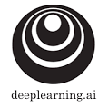
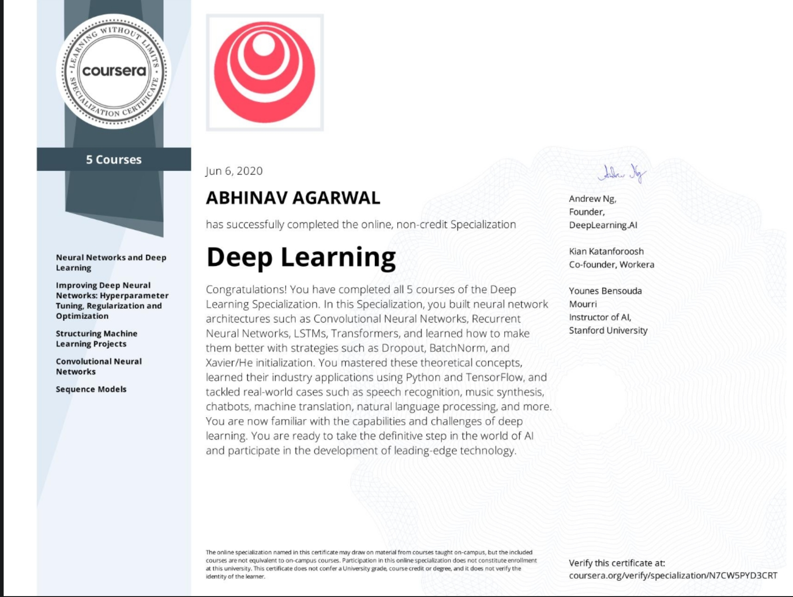
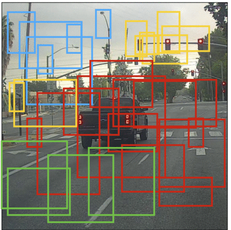
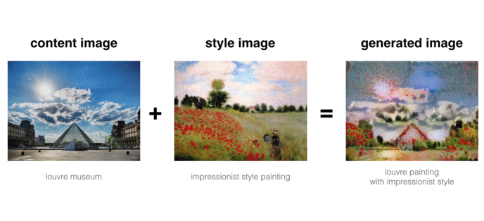
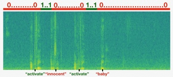

<!--
*** Thanks for checking out the Best-README-Template. If you have a suggestion
*** that would make this better, please fork the repo and create a pull request
*** or simply open an issue with the tag "enhancement".
*** Thanks again! Now go create something AMAZING! :D
-->

<!-- PROJECT SHIELDS -->
<!--
*** I'm using markdown "reference style" links for readability.
*** Reference links are enclosed in brackets [ ] instead of parentheses ( ).
*** See the bottom of this document for the declaration of the reference variables
*** for contributors-url, forks-url, etc. This is an optional, concise syntax you may use.
*** https://www.markdownguide.org/basic-syntax/#reference-style-links
-->

[![Forks][forks-shield]][forks-url]
[![Stargazers][stars-shield]][stars-url]
[![Issues][issues-shield]][issues-url]
[![MIT License][license-shield]][license-url]
[![LinkedIn][linkedin-shield]][linkedin-url]

<!-- PROJECT LOGO -->
 

  

  <h3 align="center">deeplearning.ai Specialization</h3>

  

This repository talks about my learnings through coursework and projects that I completed in deeplearning.ai specialization.    
  

# Table of contents

- [About The Specialization ](#about-the-specialization-a-nameabout-the-project-a)
- [List of Courses and Things Learnt](#list-of-courses-and-things-learnt)
- [Most Important Projects](#most-important-projects)
- [Further Recommended Readings](#further-recommended-readings)

<!-- ABOUT THE PROJECT -->
## About The Specialization

  

This Deep Learning specialization is a widely respected 5-course specialization offered by Andrew NG. This specialization teaches one to master the tools and techniques used in deep learning.

### Built With

I learned and made use of the following Python libraries in this specialization:

* [TensorFlow](https://www.tensorflow.org/)
* [SciPy](https://www.scipy.org/)
* [NumPy](https://numpy.org/)
* [Matplotlib](https://matplotlib.org/)

<!-- GETTING STARTED -->
## List of Courses and Things Learnt

### Course 1. [Neural Networks and Deep Learning](https://www.coursera.org/account/accomplishments/certificate/7TCXZL6KT3ZW)
 
* Key Foundations of Neural Networks
* Building a machine learning model with *pure python*, without using any frameworks

### Course 2. [Improving Deep Neural Networks Hyperparameter tuning, Regularization and Optimization](https://www.coursera.org/account/accomplishments/certificate/RNAJW94CCG54)

* Best practices to generate training and testing datasets
* Deep Learning blackbox optimization using techniques like *initialization*, *L2 and dropout regularization*, *hyperparameter tuning*, *batch normalization*, and *gradient checking*.
* Gradient Descent Methods Learned: *mini-batch*, *Momentum*, *RMSprop* and *Adam*
* Develop a ML model using Tensorflow.

### Course 3. [Structuring Machine Learning Projects](https://www.coursera.org/account/accomplishments/certificate/9ZQNTC57CKN8)

* *Decision Making* as a Machine Learning Project Leader
* *Diagnosing* and *Minimizing Errors*, Recognizing *mismatched training/test data sets*
* *End-to-end learning*, *transfer learning*, and *multi-task learning*
*  Provides the *industry experience* of building and shipping ML systems 

 ### Course 4. [Convolutional Neural Networks](https://www.coursera.org/account/accomplishments/certificate/LABWLA4CVAGR)
 
 * Evolution of Computer Vision
 * Applications of CNNs such as *autonomous driving*, *face recognition* and *reading radiology images*
 * Building and using a CNN for *visual recognition* and *identification*
 * *Neural Style Transfer* to generate art  

 ### Course 5. [Sequence Models](https://www.coursera.org/account/accomplishments/certificate/ZQ8RQ3RY5DUK)
 
 * Introduction to *sequence models* and their applications such as *speech recognition, music synthesis, chatbots, machine translation and natural language processing (NLP)* 
 * Building and training a *recurrent neural networks* with variations such as *GRUs* and *LSTMs*
 * *Word Embeddings*, *HuggingFace tokenizers* and *transformer models* 
 * Applications of NLP such as *Named Entity Recognition* and *Question Answering*

<!-- USAGE EXAMPLES -->

## Most Important Projects

This specialization involves working on a total of nearly 20 assignments. The following are some of the most important projects:
### Autonomous Driving System

[Colab Notebook](https://colab.research.google.com/github/anshabhi/Deep-Learning-Coursera/blob/master/Convolutional%20Neural%20Networks/Week3/Car%20detection%20for%20Autonomous%20Driving/Autonomous%20driving%20application%20-%20Car%20detection%20-%20v1.ipynb)

Use YOLO object detection model to design a model to detect objects on road from a video stream.

### Neural Art Style Transfer
[Colab Notebook](https://colab.research.google.com/github/anshabhi/Deep-Learning-Coursera/blob/master/Convolutional%20Neural%20Networks/Week4/Neural%20Style%20Transfer/Art%20Generation%20with%20Neural%20Style%20Transfer%20-%20v1.ipynb)

Use Neural Style Transfer to generate artistic images. Fundamentally, use Transfer Learning on a pre-trained CNN to transfer style from one a drawing to a portrait image.

### Trigger Word Detection
[Colab Notebook](https://colab.research.google.com/github/anshabhi/Deep-Learning-Coursera/blob/master/Sequence%20Models/Week3/Trigger%20word%20detection/Trigger%20word%20detection%20-%20v1.ipynb)

Design a Sequence model used in personal assistant devices such as Alexa and Siri to respond to a Trigger word.
Each time the user says activate, a chime is played as a trigger. Involves processing audio inputs as train/dev sets.

## Further Recommended Readings
* [DeepLearning.ai Courses Notes](https://github.com/mbadry1/DeepLearning.ai-Summary)

<!-- MARKDOWN LINKS & IMAGES -->
<!-- https://www.markdownguide.org/basic-syntax/#reference-style-links -->

[forks-shield]: https://img.shields.io/github/forks/anshabhi/ML-dl.ai.svg?style=for-the-badge
[forks-url]: https://github.com/anshabhi/ML-dl.ai/network/members
[stars-shield]: https://img.shields.io/github/stars/anshabhi/ML-dl.ai.svg?style=for-the-badge
[stars-url]: https://github.com/anshabhi/ML-dl.ai/stargazers
[issues-shield]: https://img.shields.io/github/issues/anshabhi/ML-dl.ai.svg?style=for-the-badge
[issues-url]: https://github.com/anshabhi/ML-dl.ai/issues
[license-shield]: https://img.shields.io/github/license/anshabhi/ML-dl.ai.svg?style=for-the-badge
[license-url]: https://github.com/anshabhi/ML-dl.ai/blob/master/LICENSE.txt
[linkedin-shield]: https://img.shields.io/badge/-LinkedIn-black.svg?style=for-the-badge&logo=linkedin&colorB=555
[linkedin-url]: https://linkedin.com/in/mrabhinavagarwal

